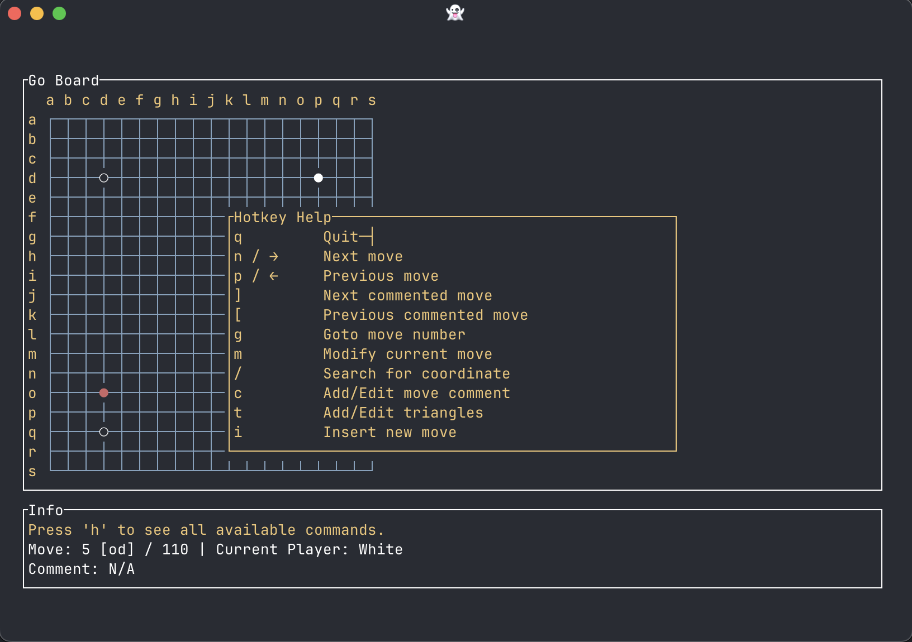

# gocat: Terminal Go Game SGF Viewer & Editor

**gocat** is a modern, interactive terminal tool for viewing and editing Go game records in SGF (Smart Game Format). It offers a powerful, keyboard-driven interface to navigate, annotate, and modify game records directly from your terminal, making it ideal for Go players and reviewers.

---

## Installation

You can install **gocat** locally using Cargo:

```sh
cargo install --path .
```

Or build and run directly from the repo:

```sh
cargo build --release
./target/release/gocat <your_file.sgf>
```

---

## Usage

To launch the interactive SGF viewer/editor:

```sh
gocat <your_file.sgf>
```

Replace `<your_file.sgf>` with the path to your SGF file.

---

## Features & Hotkeys

- `q`         Quit
- `n` / `→`   Next move
- `p` / `←`   Previous move
- `]`         Next commented move
- `[`         Previous commented move
- `g`         Goto move number
- `m`         Modify current move
- `/`         Search for coordinate
- `c`         Add/Edit move comment
- `t`         Add/Edit triangles
- `i`         Insert new move
- `x`         Remove current move
- `h`         Show this help
- `Esc`/`Enter` Close help or input dialogs


---